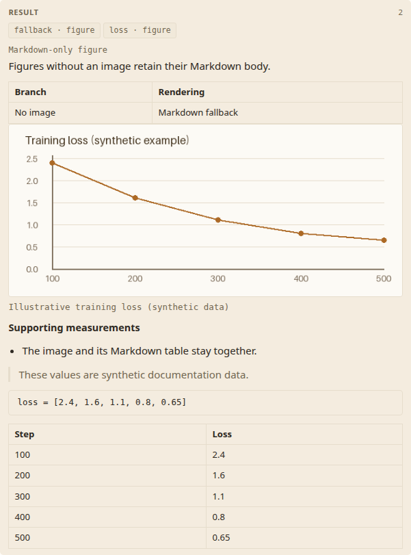
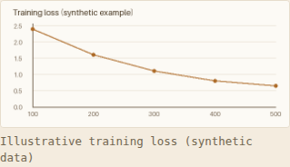

# Local images in figure exhibits
**Date:** 2026-10-02

## TL;DR

Figure exhibits render local PNG/JPEG images with description captions and keep supporting Markdown below them. Figures without a valid image keep the existing Markdown branch. Local and hub servers stream guarded image files; static sites copy referenced files beside the exported manifest. This implements [#60](https://github.com/ARA-Labs/ara-cli/issues/60) without a new export command or base64 image payloads.

## Problem

The evidence parser previously discovered only Markdown bodies, and the viewer never mounted its figure-image styles. A chart could appear only as its supporting table. The viewer also discarded which manifest URL loaded successfully, so an image reference could not distinguish API delivery from static fallback.

## Constraints

Old JSON manifests remain readable, and absent `image` fields are omitted during serialization. Existing exhibit identities, category ordering, claim linkage, description/source precedence, raw bodies, and Markdown sanitization remain in place. The renderer accepts PNG and JPEG (`.png`, `.jpg`, `.jpeg`, case-insensitive); SVG, remote images, recursive discovery, and single-file inline export are outside this change.

References are filesystem names, not URLs. Native and viewer guards reject schemes, authority forms, absolute paths, parent-directory components, backslashes, drive paths, empty path components, and control characters. Literal spaces, Unicode, `%`, `#`, and `?` are encoded once per URL segment. Native resolution checks regular files, PNG/JPEG signatures, and containment under the canonical evidence root. A selected artifact root and contained image files may be symlinks; escaping asset symlinks are rejected. Canonicalize-then-open checks do not promise race-proof access during hostile concurrent filesystem mutation.

## Proposed approach

`Exhibit.image: Option<String>` carries an artifact-relative reference such as `evidence/figures/loss.png`. A companion pair keeps its Markdown path in `file` and its unchanged Markdown in `body`; an image-only exhibit uses its raster path and an empty body. `evidence.rs` groups direct-child Markdown and raster files, preserving deterministic category and file ordering. Directories with raster extensions are not image candidates.

Image selection follows this precedence:

1. An explicit body bullet, relative to `evidence/`:
   ```markdown
   - **Image**: figures/loss.png
   ```
2. A raster `File` entry in `evidence/README.md`:
   ```markdown
   | File | Description | Claims |
   |---|---|---|
   | figures/loss.png | Training loss | C01 |
   ```
3. A unique same-stem raster sibling of a Markdown figure.

An invalid explicit declaration does not fall back to another sibling. Multiple candidates require a declaration. A differently named asset referenced by a Markdown figure is not also emitted as a standalone exhibit. Suppression applies to the selected image path, not every format sharing its stem: an independently indexed JPEG remains an exhibit even when another figure references the same-stem PNG. Missing, unsafe, unsupported, and ambiguous references report `ARA216`; source bodies remain available.

`source.rs` keeps the successful response URL with its manifest update. Static images resolve beside that effective manifest URL; API images strip `evidence/` and use `figure/<encoded path>` beside the matching `api/manifest`. Redirects, fallback, refetches, and hub prefixes therefore keep the correct artifact context. Downloaded JSON passes the same viewer-side reference guard before any image URL is constructed.

The local `/api/figure/{*path}` and hub `/a/{id}/api/figure/{*path}` handlers share validation and call `tower-http::ServeFile` with the original request. HEAD, Range, and conditional handling are retained. Responses set explicit image MIME and `X-Content-Type-Options: nosniff`; rejected or missing images return a real missing-file response.

The viewer mounts `<figure class="detail-figure"><figcaption>` through ordinary escaped Leptos nodes. `description` supplies the caption and alternative text; absent descriptions omit the caption and use the exhibit id as alternative text. Image-only figures remain visible. Supporting Markdown follows in `.exhibit-body` without a duplicate description paragraph. No-image figures retain caption-above-Markdown rendering; non-figure exhibits remain Markdown-only.

## Alternatives considered

| Representation | Benefit | Cost |
|---|---|---|
| Local references, used here | Small manifests and streamed server images | Static deployments must copy referenced files |
| Base64 in every manifest | Self-contained JSON | Larger manifests and repeated live-reload payloads |
| Streamed serve images with an inline export mode | Efficient serving and self-contained export | A new export option and two image representations |

## Tradeoffs

Embedded mode packages reusable viewer assets, not artifact images. Static hosting needs the image files as well as `manifest.json`; exporting JSON alone is insufficient. `ara layout --json` still writes JSON to stdout and does not copy assets. The existing wasm size gate remains separate from user image sizes.

A complete adjacent-manifest static deployment can be built from the repository root:

```bash
ARA_DIR=/path/to/artifact
SITE_DIR="$PWD/site/viewer"
(cd crates/ara-viewer && TRUNK_BUILD_CARGO_PROFILE=wasm-release trunk build --release --public-url /site/viewer/ --dist "$SITE_DIR")
ara layout "$ARA_DIR" --json > "$SITE_DIR/manifest.json"
cp -R "$ARA_DIR/evidence" "$SITE_DIR/"
python3 -m http.server 8080
# Open http://127.0.0.1:8080/site/viewer/
```

`SITE_DIR` contains the built viewer, exported manifest, and `evidence/` at the same relative paths stored in the manifest. Use Trunk's `--public-url` for the hosting prefix; the root-hosted embedded bundle's absolute asset URLs are not a nested-site build. For a viewer document in another directory, its `<base href>` can point at the manifest directory while the built asset URLs retain their configured prefix. The smoke deployment used `/site/viewer/index.html`, `<base href="../data/artifact/">`, and assets/manifest/images under `/site/data/artifact/`, without an API.

## Migration

Regenerate manifests with the new parser to acquire `image` fields. Old no-image manifests need no migration. Authors may keep their Markdown supporting tables, add a same-stem image, or declare an explicit local reference. Index raster-only exhibits when they need claim linkage and a caption.

Native tests cover precedence, pairing, raster-only linkage, compatibility, rejected declarations, directories, ambiguity, and distinct indexed formats. HTTP tests cover local/hub bytes, MIME, ranges, conditionals, traversal, and symlinks. Real browser tests decode fixture PNGs, including punctuation filenames and a wide image, and cover fallback/refetch, captions, retained tables, no-image rendering, and narrow geometry. Actual embedded, source-assets, hub, and nested API-free static smoke runs decoded a 480×200 PNG and retained both Markdown tables; desktop and 375px checks found no page-level horizontal overflow.

## Screenshots

These captures use synthetic data in an artifact served by `ara serve` with the embedded viewer. The desktop viewport is 1280px wide; the mobile viewport is 375px wide. Images are cropped to the relevant detail block.

### Images and Markdown in the same result block

The image-bearing figure keeps its caption and supporting table. The same block shows a Markdown-only figure and styled headings, a list, a blockquote and a code block.



### A figure on mobile

The image scales to fit the narrow viewport, and the caption wraps below it.



## Next Steps

Keep referenced images within the evidence root, rebuild the viewer for the chosen static hosting prefix, and copy the files when deploying exported JSON. Re-run the native/HTTP/browser suites and embedded freshness check when changing image discovery, URL resolution, or serving guards.
