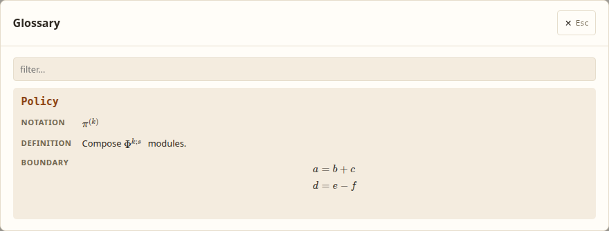
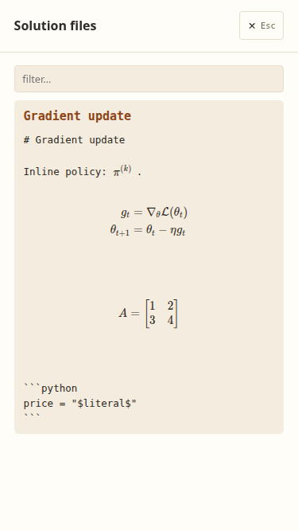
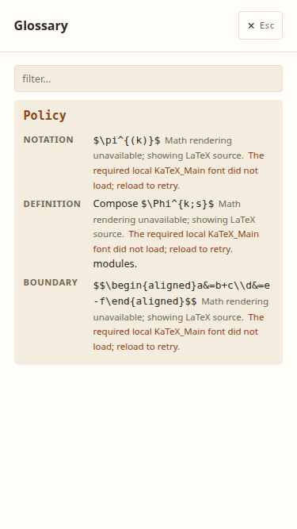

# Local math rendering in Glossary and Solution files
**Date:** 2026-10-02

## TL;DR

Glossary and Solution-file panels typeset dollar-delimited inline and display equations with locally packaged KaTeX 0.19.0. Renderer JavaScript, CSS and fonts load only when a mounted panel entry contains math, so the renderer stays outside the main wasm bundle and works without a CDN. The viewer keeps original source visible while loading and shows source with a visible error if an equation or local asset fails. Code ranges and surrounding text stay unchanged; exhibit Markdown does not acquire math rendering.

## Problem

Issue [#31](https://github.com/ARA-Labs/ara-cli/issues/31) requested readable LaTeX in the Glossary and Recipes panels, now labelled Solution files. The former `latex_segments` and `latex_view` helpers split on individual dollar signs and displayed inert monospace source. They could not distinguish display delimiters or avoid interpreting dollar signs inside source code. Real artifacts carry pi/Phi notation and display equations containing aligned rows, cases and matrices.

## Constraints

The main viewer must retain its wasm size gates. Renderer assets therefore ship as separate local files through Trunk, the embedded viewer directory and `--assets` distributions. No renderer or font depends on a CDN, including when hub mode injects `<base href="/a/{id}/">` or a static viewer lives under a hosting prefix.

This change supports `$...$` inline math and `$$...$$` display math, including delimiter-wrapped AMS environments. Inline content remains on one source line and has non-whitespace edges. A single-dollar close immediately followed by a digit is not a math delimiter, preserving currency such as `$5 and $10`. Escaped and unmatched dollars stay literal. Pulldown-cmark source offsets protect inline, fenced and indented code without reserializing surrounding Markdown.

Bare AMS environments, `\(...\)`/`\[...\]` delimiters, multiline continuation parsing in `logic/concepts.md`, exhibit math and full Markdown rendering of Solution files are outside this contract. Concepts remain line-oriented: single-line display values render there; complete Solution-file bodies support multiline aligned source. This scope leaves existing authoring semantics, parser behavior and raw-source treatment intact.

## Proposed approach

`crates/ara-viewer/src/math.rs` partitions text into borrowed plain-source and math fragments. A fragment retains its exact original spelling, byte range, delimiter-free TeX and inline/display mode. `MathText` converts recognized fragments into owner-scoped components and preserves literal text around them. Leptos owns each host and its escaped fallback/status nodes; the renderer owns only descendants committed to that host. Solution files use a preformatted raw-text container that can legally contain display blocks, replacing the old `pre` wrapper.

`public/math-loader.js` captures its own script URL and resolves `vendor/katex-0.19.0/` beside that script. The first mounted math fragment starts one shared renderer/CSS load promise. The loader verifies the pinned version/API, CSS delivery and font faces required by actual output before declaring success. Math-free pages and closed panels make no renderer/CSS/font requests, although the small bridge script loads with the page. Script, stylesheet and font availability failures remain cached for that page; reload is the explicit retry. No automatic retry or remote fallback is added.

Each expression starts with fresh macros and these renderer options. Before rendering, the loader parses with the same pinned options and rejects KaTeX's trust-denied color sentinel throughout the parse tree, including nested HTML/MathML-only branches that could discard denial nodes from final output. The sentinel cannot be a valid author-supplied color under the pinned parser's color grammar. Malformed expressions and trust-denied commands fail only their own fragment, preserving original source and escaped diagnostic text.

| Option | Value | Purpose |
| --- | --- | --- |
| `output` | `htmlAndMathml` | Typeset output with accessible MathML |
| `trust` | `false` | Reject artifact-controlled URLs, HTML and other trust-sensitive commands |
| `globalGroup` | `false` | Keep macro definitions within one expression |
| `macros` | Fresh object | Prevent cross-expression macro pollution |
| `maxExpand` | `1000` | Bound recursive macro expansion |
| `maxSize` | `20` | Bound author-supplied dimensions |
| `throwOnError` | `true` | Report malformed equations as local failures |
| `strict` | Default warning policy | Retain upstream warnings |

A render job has an independent lifetime from shared asset loading. Closing the modal, filtering an entry out or replacing the manifest cancels that fragment and removes its temporary font-verification probe. Asynchronous completion checks owner liveness and host connection before appending output or changing signals. Reopening mounts current source with the cached renderer. Inline hosts retain prose layout; display hosts scroll locally when needed. Shrinkable Glossary fields and raw-text wrapping keep long equations and source from widening the page.

## Alternatives considered

KaTeX's auto-render helper would mutate panel text owned by Leptos and still require code protection and raw-source display handling. Direct fragment hosts keep the ownership boundary explicit. A pure-Rust renderer would need separate equation-coverage and wasm-size evaluation; the pinned KaTeX release already covers the requested expressions. Remote lazy loading would reduce packaged bytes but would break offline use and introduce an external availability dependency.

## Tradeoffs

The wasm gate measures only wasm, not the added renderer, styles or fonts. Lazy loading avoids those asset requests when no math is mounted, but the packaged distribution and embedded binary grow. The loader also depends on the pinned KaTeX `__parse` API to identify denied commands before conditional output can hide them. Updating KaTeX requires checking that API, the invalid-color sentinel and the nested trust-denial tests; version/API mismatches produce visible source fallback.

The final `wasm-release` distribution at workspace version `0.1.21` has these measured byte counts. Brotli uses quality 11; distribution totals sum independently compressed files and are not a measured browser transfer. The whole package includes all three upstream font formats and license/provenance records, while a browser requests only the font faces and formats it needs.

| Asset set | Raw bytes | Brotli q11 bytes |
| --- | ---: | ---: |
| Main viewer wasm | 737,227 | 244,426 |
| Wasm gate | 1,048,576 | 358,400 |
| Local bridge script | 7,069 | 2,085 |
| KaTeX renderer JavaScript | 272,868 | 63,029 |
| KaTeX stylesheet | 24,793 | 2,911 |
| Vendor files excluding `provenance.json` | 1,424,262 | 919,130 |
| Entire viewer distribution, 72 files | 2,291,255 | 1,188,585 |

The unmodified release comes from [KaTeX 0.19.0](https://github.com/KaTeX/KaTeX/releases/tag/v0.19.0), with archive SHA-256 `966d9c85655081cca9a57e8a1d667f13f96b1c85c3f93655a8acef74c4ce3875`. `provenance.json` records the upstream URLs and shipped-file hashes. All 60 referenced TTF/WOFF/WOFF2 binaries retain their upstream bytes and name-table metadata; `font-notices.json` records their individual copyright/license notices. `LICENSE-MIT.txt` covers the renderer, and `OFL.txt` preserves the fonts' applicable SIL Open Font License text. No font is renamed or subsetted, and auto-render/contrib extensions are not shipped.

## Migration

The obsolete inert splitter, view helper, CSS and tests are removed; every panel consumer now uses `MathText`. Existing artifact files and serialized manifests are unchanged. Author inline notation as `$\pi^{(k)}$` and display equations as `$$\begin{aligned}a&=b\\c&=d\end{aligned}$$`. Use code spans or fenced/indented code when dollars must remain source. The entire Trunk distribution, including the versioned vendor directory, must be copied when deploying statically. `scripts/embed-viewer.sh` regenerates the embedded assets and `--check` verifies their freshness.

Native tests assert exact source reconstruction, protected-code boundaries, inline/display precedence, currency and escaped/unmatched delimiters. Real-renderer Chrome tests inspect superscript and aligned-row MathML, accessible math, source preservation, malformed-neighbor isolation, trust-sensitive aliases/hidden branches, macro pollution/expansion bounds and local overflow. They also cover shared loading across both panels, visible cached JS/CSS/font failures, filter/reopen, modal close and manifest replacement during loading. The tests intercept only local asset delivery for failure/delay cases; equation output is never mocked.

Final verification passed 492 native workspace tests (one ignored) and 72 headless Chrome tests, native and wasm32 all-target Clippy with warnings denied, formatting, wasm builds and embedded freshness. Actual embedded, source-assets, hub and API-free nested static pages rendered both panels with external domains blocked and no vendor requests before a panel mounted. Desktop and 375px screenshots retained raw code and showed no page overflow. Blocking real renderer JS, CSS and font requests produced visible original-source fallback; reopening after a renderer failure made no extra asset requests. The static check put the viewer and manifest in different directories and also decoded the retained 480 by 200 figure with both Markdown tables.

## Screenshots

These captures use a synthetic documentation artifact served by `ara serve` with the embedded viewer. The desktop viewport is 1280px wide; the mobile viewport is 375px wide. Images are cropped to the open panel.

### Glossary on desktop

Inline pi/Phi notation and a two-row display equation render with the local math assets.

### Solution files on mobile

The gradient update and matrix fit the narrow panel. The fenced Python example keeps its literal dollar signs and raw source formatting.

### When a required font fails to load

This capture blocks the local font requests. The panel retains the original LaTeX and shows the missing-font diagnostic with instructions to reload.

## Next Steps

When updating the pinned renderer, verify the release digest, inspect the exact new font metadata and replace provenance and license records together. Run the native and real-browser suites, exercise embedded/source/static/hub pages with external requests blocked, measure wasm and total assets separately, then regenerate and check the embedded viewer. Keep exhibit math and concept-parser changes separate from this panel-rendering contract.
